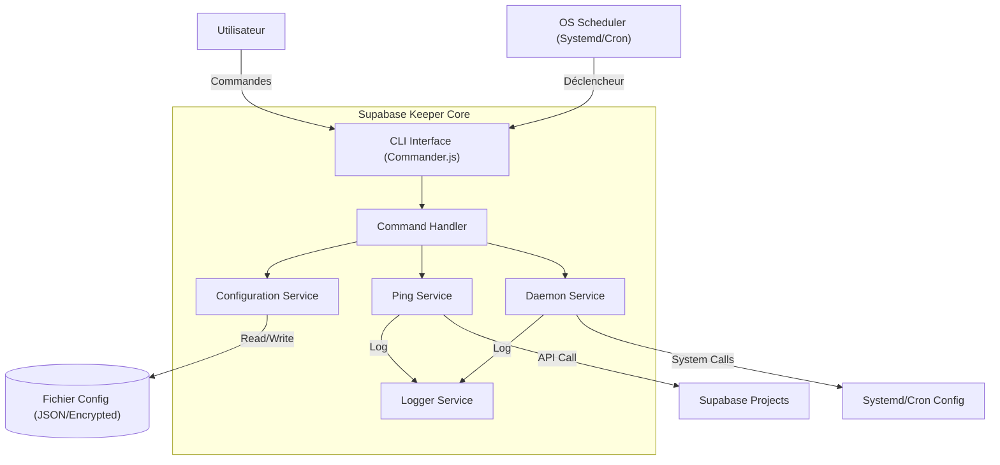

# Architecture Système : Supabase Keeper

**Date :** 02/03/2026
**Projet :** Supabase Keeper
**Version :** 1.0
**Statut :** Validé
**Auteur :** System Architect AI

## 1. Vue d'ensemble de l'Architecture

### 1.1 Modèle Architectural

L'architecture suit un modèle de **CLI Modulaire** (Command Line Interface) avec séparation des préoccupations entre l'interface utilisateur (commandes), la logique métier (services), et la persistance (configuration).

L'application fonctionne selon deux modes principaux :

1.  **Mode Interactif (CLI)** : L'utilisateur interagit pour configurer, lister, ou tester.
2.  **Mode Daemon (Background)** : Le système d'exploitation (via Systemd/Cron/PM2) invoque l'application périodiquement pour exécuter la logique de maintenance (ping).

### 1.2 Diagramme de Haut Niveau



## 2. Composants Système

### 2.1 Interface CLI (Entry Point)

- **Responsabilité** : Parser les arguments, afficher l'aide, router vers le bon contrôleur.
- **Technologie** :
  - **`commander`** : Pour la structure des commandes et les flags (ex: `--help`, `--version`).
  - **`@clack/prompts`** : Pour l'interactivité riche et moderne (wizards, spinners, inputs) lors des commandes comme `init`.
- **Commandes Clés** : `init`, `add`, `remove`, `list`, `ping`, `doctor`, `daemon`.

### 2.2 Configuration Service

- **Responsabilité** : Gérer le stockage persistant des projets (URL, Clés).
- **Sécurité** : Assurer que le fichier de configuration a des permissions strictes (0600).
- **Format** : JSON stocké dans `~/.supabase-keeper/config.json`.
- **Librairie** : `conf` ou `dot-json`.

### 2.3 Ping Service

- **Responsabilité** : Exécuter la logique de "réveil" des projets.
- **Logique** :
  - Sélectionner les projets à pinger.
  - Appliquer le "Jitter" (variation aléatoire) si nécessaire.
  - Exécuter une requête légère (`SELECT 1`).
  - Gérer les retries (backoff exponentiel).
- **Librairie** : `@supabase/supabase-js` (pour la compatibilité officielle) ou `fetch` natif (pour la légèreté).

### 2.4 Daemon Service

- **Responsabilité** : Installer et gérer la persistance du processus.
- **Stratégies** :
  - **Systemd** : Génération de fichier `.service` dans `~/.config/systemd/user/`.
  - **Cron** : Ajout d'une entrée crontab.
  - **PM2** : Interaction avec l'API PM2 (si détecté).

### 2.5 Logger Service

- **Responsabilité** : Tracer l'activité pour le débogage et la confirmation de fonctionnement.
- **Format** : Fichier texte avec rotation (max 5MB).
- **Chemin** : `~/.supabase-keeper/logs/keep-alive.log`.

## 3. Stack Technique

| Composant         | Choix Technologique            | Justification                                                                                   |
| ----------------- | ------------------------------ | ----------------------------------------------------------------------------------------------- |
| **Langage**       | TypeScript                     | Typage fort pour la robustesse et la maintenabilité.                                            |
| **Runtime**       | Node.js (v18+)                 | Large compatibilité, écosystème riche.                                                          |
| **CLI Framework** | `commander` + `@clack/prompts` | `commander` gère les arguments, `@clack` offre une expérience interactive (wizards) supérieure. |
| **HTTP Client**   | `@supabase/supabase-js`        | Client officiel, gère l'auth correctement.                                                      |
| **Config**        | `conf`                         | Gestion simple de la config utilisateur multi-plateforme.                                       |
| **Logging**       | `winston` ou `pino`            | Gestion native de la rotation et des niveaux de log.                                            |
| **Styling CLI**   | `picocolors` (via clack)       | Inclus dans clack, remplace chalk pour l'UX moderne.                                            |

## 4. Flux de Données

### 4.1 Flux d'Initialisation (`init`)

1.  Utilisateur lance `supabase-keeper init`.
2.  CLI demande URL et Key.
3.  CLI valide la connexion (ping test).
4.  ConfigService sauvegarde les crédentiels (chiffrés si possible, ou fichier protégé).
5.  DaemonService détecte l'OS et propose la méthode d'installation (Systemd par défaut sur Linux).
6.  DaemonService génère et active le service.

### 4.2 Flux d'Exécution (Daemon)

1.  Le Scheduler (Systemd) lance `supabase-keeper ping --all`.
2.  ConfigService charge la liste des projets.
3.  Pour chaque projet :
    - PingService calcule si le ping doit être fait maintenant (logique de fréquence + jitter).
    - Si OUI : Envoie `SELECT 1` à Supabase.
    - Si SUCCÈS : Log "Success".
    - Si ÉCHEC : Log "Error", planifie un retry rapide.

## 5. Considérations Non-Fonctionnelles (NFR)

### 5.1 Sécurité (NFR-05)

- **Stockage des Clés** : Le fichier de configuration doit être créé avec `mode: 0o600` (lecture/écriture propriétaire uniquement).
- **Dépendances** : Audit régulier (`npm audit`) pour éviter les vulnérabilités dans les paquets tiers.

### 5.2 Performance (NFR-01)

- **Cold Start** : Le script doit s'exécuter rapidement (< 500ms pour démarrer).
- **Mémoire** : L'utilisation mémoire doit rester faible (< 50MB). L'utilisation de `fetch` natif au lieu de grosses librairies est privilégiée si `@supabase/supabase-js` est trop lourd (à vérifier).
- **Note** : `@supabase/supabase-js` est tree-shakable, donc acceptable.

### 5.3 Fiabilité (NFR-03)

- **Erreurs Réseau** : Implémentation d'un mécanisme de retry (3 tentatives avec délai exponentiel : 1s, 2s, 4s).
- **Crash Recovery** : Systemd/PM2 gèrent le redémarrage du processus en cas de crash non géré.

## 6. Structure du Projet (Provisoire)

```
supabase-keeper/
├── src/
│   ├── commands/       # Contrôleurs des commandes (init, list, ping)
│   ├── services/       # Logique métier
│   │   ├── config.ts   # Gestion de la configuration
│   │   ├── ping.ts     # Logique d'appel Supabase
│   │   ├── daemon.ts   # Gestion Systemd/Cron
│   │   └── logger.ts   # Gestion des logs
│   ├── utils/          # Helpers (validation, crypto, etc.)
│   ├── types/          # Définitions TypeScript
│   └── index.ts        # Point d'entrée CLI
├── test/               # Tests unitaires
├── package.json
├── tsconfig.json
└── README.md
```

## 7. Décisions Architecturales Clés

1.  **Pourquoi Node.js et pas Go/Rust ?**
    - Pour la facilité de contribution (l'utilisateur cible est souvent un dev JS/TS).
    - L'écosystème npm facilite la distribution.
    - La performance de Node.js est suffisante pour cette tâche.

2.  **Pourquoi Systemd User Service ?**
    - Permet de lancer le service sans `sudo`.
    - Standard sur la plupart des distributions Linux modernes (Ubuntu, Debian, Fedora).
    - Gère nativement les logs (journalctl) et le redémarrage.

3.  **Pourquoi stocker les clés en local ?**
    - Respect de la vie privée (argument de vente principal).
    - Évite la complexité d'un serveur de gestion de clés centralisé.

## 8. Prochaines Étapes

1.  Validation de l'architecture.
2.  Initialisation du repository.
3.  Création des tickets (User Stories) pour le Sprint 1.
